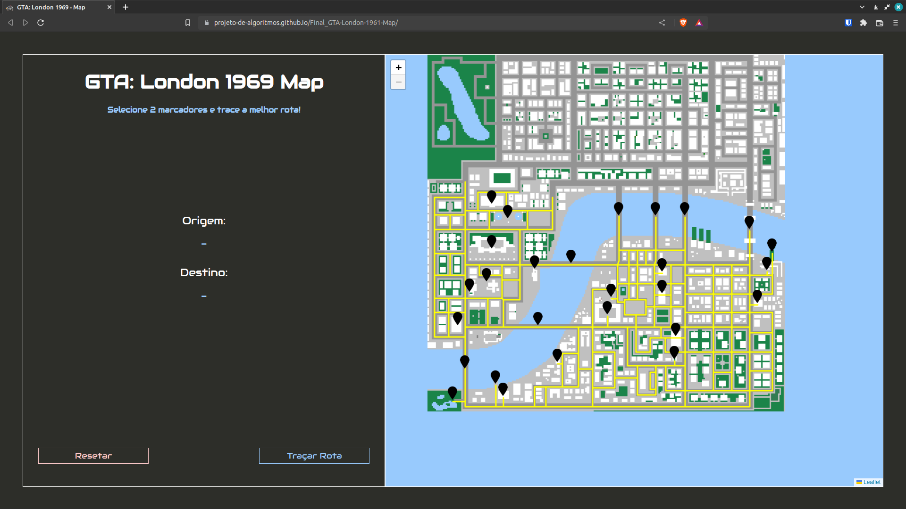

# GTA London 1961 Map

**Número da Lista**: 36  
**Conteúdo da Disciplina**: Grafos 2  

## Alunos

| Matrícula | Aluno                                                |
| --------- | ---------------------------------------------------- |
| 170144488 | [Henrique Melo](https://github.com/HenriqueAmorim20) |
| 180122258 | [Igor Queiroz Lima](https://github.com/igorq937)     |

## Sobre

Se trata de uma área do mapa de Londres em 1961 do jogo GTA. Existem alguns pontos de interesse do jogo, que ao selecionar dois pontos, é possível traçar a menor rota.

## Screenshots

 
 
 

## Instalação

**Linguagem**: JavaScript  
**Framework**: [Leaflet](https://leafletjs.com/) (Biblioteca) 
Pode ser executado utilizando a extensão [Live Server](https://marketplace.visualstudio.com/items?itemName=ritwickdey.LiveServer) do VSCode ou utilizando [http-server](https://github.com/http-party/http-server) que pode ser instalado com o comando ``npm install --global http-server``.

## Uso

Para utilizar sem nenhuma instalação acesse https://projeto-de-algoritmos.github.io/Grafos2_GTA-London-1961-Map;

Caso deseje usar a exetensão Live Server do VSCode, abra o arquivo ``index.html`` com a extensão;

Caso deseje usar http-server, basta utilizar o comando no diretório root do projeto ``http-server``.

***OBS:*** Utilizar apenas o navegador e executar o index.html não funcionará!

